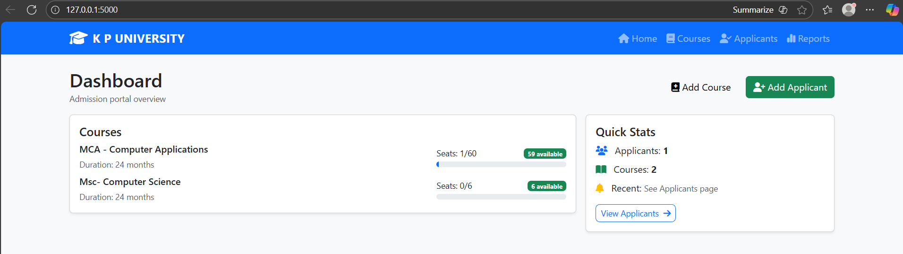
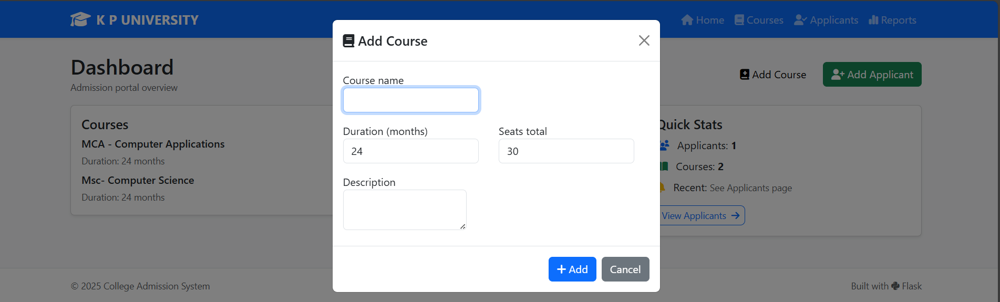
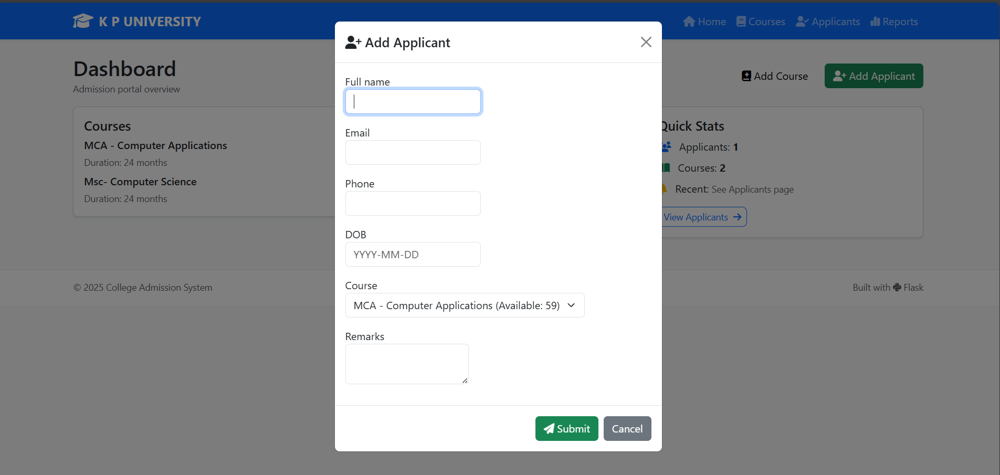
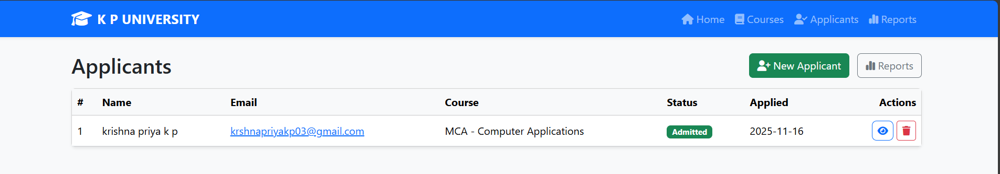
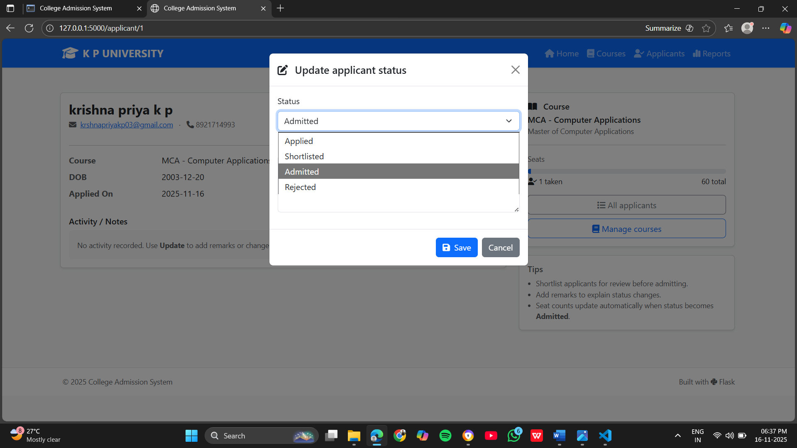
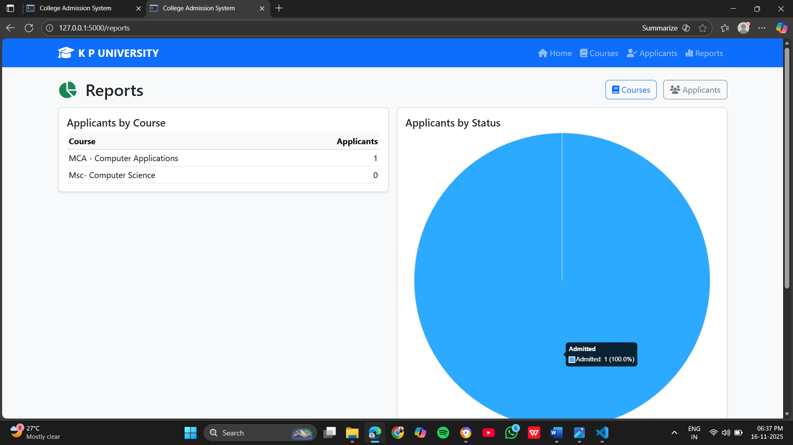
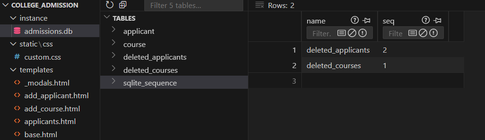

#  College Admission Management System  
A full-stack web application that manages college admission workflows including courses, applicants, seat allocation, status updates, and analytical reports.  
Developed using **Flask + SQLite + Bootstrap + Chart.js** for academic project purposes (MCA).

---

##  Features

✔ Add, Edit, Delete Courses  
✔ Add Applicants & Assign Course  
✔ Automatic Seat Management per Course  
✔ Update Application Status (Applied → Shortlisted → Admitted → Rejected)  
✔ Database Trigger Backup for Deleted Records  
✔ Interactive Dashboard and Reports  
✔ Pie Chart for Application Status  
✔ Bootstrap UI with Icons and Modals  

---

##  Technology Stack

| Layer | Technology |
|-------|------------|
| Frontend | HTML, Bootstrap 5, FontAwesome Icons |
| Backend | Flask (Python), Jinja2 Templates |
| Database | SQLite + SQLAlchemy ORM |
| Charts | Chart.js |
| IDE Used | VS Code |
| Version Control | Git & GitHub |

---

##  Database Design

### **Tables Used**
| Table Name | Description |
|------------|-------------|
| `course` | Stores course details and seat capacity |
| `applicant` | Stores applicant info and current status |
| `deleted_applicants` | Backup table (auto-filled by trigger) |
| `deleted_courses` | Backup table for deleted courses |
| `sqlite_sequence` | Handles AUTOINCREMENT values |

---

##  SQLite Components Used

| Component | Usage |
|-----------|-------|
| **Primary Key** | `id` for all main tables |
| **NOT NULL Constraints** | Prevents blank course names, applicant emails |
| **UNIQUE Constraint** | Email must be unique |
| **Foreign Key** | `applicant.course_id → course.id` |
| **Trigger** | Automatically backs up deleted courses & applicants |
| **Default Values** | Auto Timestamp for deletion backup |

---

##  Trigger – Auto Backup After Delete

### 1. When an Applicant is Deleted  
→ Record is copied into `deleted_applicants`

### 2. When a Course is Deleted  
→ Record is copied into `deleted_courses`

>  Ensures **auditability** and **data recovery**

---

##  How to Run

### **1️ Create Virtual Environment**
```
python -m venv venv
source venv/bin/activate     # Mac / Linux
venv\Scripts\activate        # Windows
```

### **2️ Install Dependencies**
```
pip install -r requirements.txt
```

### **3️ Initialize Database**
```
python app.py initdb
```
✔ Creates tables  
✔ Inserts sample data  
✔ Creates trigger + backup tables

### **4️ Start Server**
```
python app.py
```
Open Browser 👉 **http://127.0.0.1:5000**

---

##  Reports Generated

✔ Number of Applicants Per Course (Bar Chart)  
✔ Application Status Distribution (Pie Chart)  

---

##  Screenshots

| Screen | Screenshot |
|--------|------------|
| Dashboard |  |
| Add Course |  |
| Add Applicant |  |
| View Applicants |  |
| Edit Status |  |
| Reports Pie Chart |  |
| Trigger Backup Table |  |

